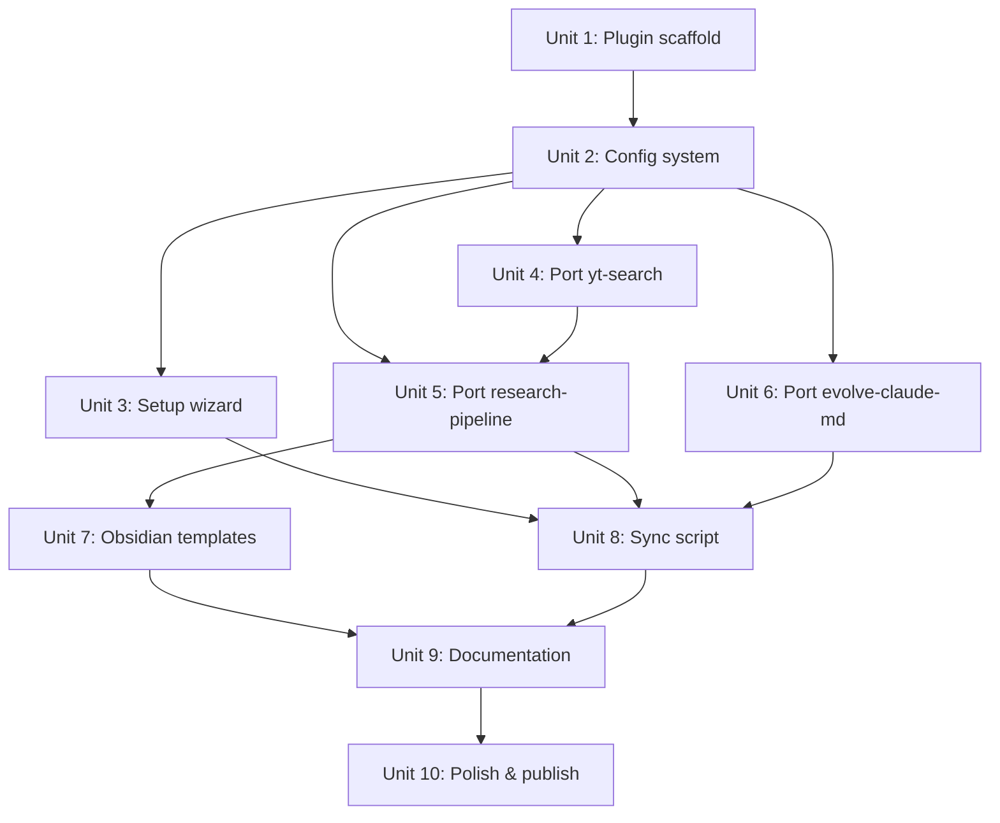

# feat: Ship Revolve as open-source Claude Code plugin

## Overview

Package three existing private skills (`research-pipeline`, `evolve-claude-md`, `yt-search`) into an open-source Claude Code plugin named **Revolve**, along with a Python conversation sync script, Obsidian templates, and bilingual documentation. The plugin creates a self-reinforcing flywheel: research → analyze → store → evolve → better AI.

## Problem Frame

AI coding assistants start each session fresh. Knowledge is scattered, research is repeated, and CLAUDE.md stays static. Revolve closes this loop by automating the research-analyze-store-evolve cycle. The three skills already work privately — this plan packages them for public distribution with proper configuration, documentation, and portability. (see origin: `docs/brainstorms/2026-04-02-revolve-open-source-requirements.md`)

## Requirements Trace

- R1. Publish as Claude Code plugin `revolve` on marketplace
- R2. Plugin installs 4 skills: `/research-pipeline`, `/evolve-claude-md`, `/yt-search`, `/revolve-setup`
- R3. One-command install: `claude plugin install revolve`
- R4. Skills work independently but chain naturally
- R5–R11. Research pipeline: multi-source → NotebookLM → Obsidian
- R12–R16. Evolution: dual-layer scan → append-only CLAUDE.md
- R17–R19. YouTube search: yt-dlp structured results
- R20–R25. Sync script: 4-provider conversation → Obsidian with image extraction
- R26–R28. Obsidian templates: research note + dataview index
- R29–R32. Documentation: bilingual README, conceptual guide, demo
- R33–R34. Configuration: no hardcoded paths, setup wizard

## Scope Boundaries

- Not a general Obsidian plugin — requires Claude Code runtime
- Not replacing CE / claude-mem / Prismer — complements them
- Evolution only targets CLAUDE.md (sync reads other providers, evolution writes only Claude config)
- No web UI — terminal + Obsidian is the interface
- No auto-evolution without user approval
- `research_start` (deep research, ~5min) is opt-in via `--deep` flag, not default
- Sync script ships in the GitHub repo under `scripts/` but is not a plugin skill — `claude plugin install revolve` does not install or register it. Users set it up separately via README instructions

## Context & Research

### Relevant Code and Patterns

- **Existing skills**: `~/.claude/skills/research-pipeline/SKILL.md`, `~/.claude/skills/evolve-claude-md/SKILL.md`, `~/.claude/skills/yt-search/SKILL.md` — full implementations to port
- **Plugin structure**: `.claude-plugin/plugin.json` manifest + `skills/*/SKILL.md` auto-discovery (ref: `claude-plugins-official/plugins/plugin-dev`)
- **Plugin example**: `compound-engineering-plugin` — `AGENTS.md`, `CHANGELOG.md`, `README.md`, `LICENSE`, `skills/`, `agents/` layout
- **MCP tools**: NotebookLM tools via `mcp__notebooklm-mcp__*` prefix — `notebook_create`, `source_add`, `notebook_query`, `research_start`, `studio_create`, `studio_status`
- **Path convention**: `${CLAUDE_PLUGIN_ROOT}` for plugin-internal paths; user paths via config

### Institutional Learnings

- nlm CLI syntax trial-and-error reached 13 consecutive retries → always `<cmd> --help` first before invoking CLI tools
- Large .jsonl files trigger token overflow → use `wc -l` to estimate, read with `offset`+`limit`, or grep for target lines
- evolve-claude-md must never modify existing CLAUDE.md content — append-only is a safety invariant
- Skill `description` field is the trigger mechanism — must be specific English phrases for reliable activation
- `${CLAUDE_PLUGIN_ROOT}` is the only safe path reference in hooks and MCP configs

### External References

- Claude Code plugin structure: `claude-plugins-official/plugins/plugin-dev/skills/plugin-structure/`
- Plugin manifest reference: `plugin-dev/skills/plugin-structure/references/manifest-reference.md`
- Plugin marketplace submission: `clau.de/plugin-directory-submission`
- NotebookLM MCP tools: `~/.claude/skills/research-pipeline/references/notebooklm-tools.md`

## Key Technical Decisions

- **Unified configuration via `~/.config/revolve/config.md`**: User-specific config (vault path, output dir, screenshot dir, sync providers) stored in a single Markdown file with YAML frontmatter at `~/.config/revolve/config.md`. Both plugin skills and the sync script read from this same path. Rationale: unified config avoids dual-path problem where skills (inside Claude Code) and sync script (outside Claude Code) would need separate configs. `${CLAUDE_PLUGIN_ROOT}` is inaccessible to the standalone sync script, and per-project `.claude/` config doesn't fit a global tool. This is a Revolve-specific convention, not an existing plugin ecosystem pattern.

- **Setup wizard as `/revolve-setup` skill**: Interactive skill that detects Obsidian vault, checks dependencies, and writes `~/.config/revolve/config.md`. Rationale: skills are the natural interaction model in Claude Code; a CLI script would bypass the plugin's own runtime.

- **Skill descriptions in English, third-person format**: All `SKILL.md` description fields use the third-person pattern required by the plugin ecosystem: `"This skill should be used when the user asks to '<trigger phrase>'..."`. This follows the plugin-dev documentation requirement. All 4 skills are user-invoked (not auto-activated), so descriptions should emphasize usage and arguments. Each skill also declares `argument-hint` frontmatter for discoverability in `/help`. Skill body content can mix languages. Rationale: third-person format is a hard requirement per plugin-dev docs; argument-hint improves UX.

- **Sync script as standalone `scripts/sync_conversations.py`**: Single-file Python script with no pip dependencies beyond stdlib + `Pillow` (optional, for image processing). Users run directly or set up launchd/cron. Rationale: zero installation friction, matches R25 standalone requirement.

- **4-provider sync from v1.0**: Claude (.jsonl), Codex (sessions .jsonl), OpenCode (prompt-history .jsonl — limited to inputs only), Gemini (session .json) — all providers the user actively uses. Rationale: requirements R20 calls for multi-provider; the user has experience with all four formats. Note: OpenCode may only store prompts, not full conversations — investigate during implementation and degrade gracefully if full turns are unavailable.

- **evolve scans entire vault, research writes to output_dir**: The evolve skill scans `vault_path` (entire vault) for .md files, while research-pipeline writes to `output_dir` (a subdirectory of vault_path). The setup wizard validates that `output_dir` is under `vault_path`. This ensures the flywheel chain works: research notes written to output_dir are always within evolve's scan scope.

- **Append-on-conflict for research notes**: When same-day same-topic note exists, append new analysis block with `---` separator and timestamp. Rationale: preserves iteration history without silent overwrite.

- **`research_start` is opt-in**: Default research uses `notebook_query` (seconds). Deep research via `research_start` (~5min) requires explicit flag. Rationale: 5-minute wait without warning causes frustration; opt-in preserves fast-path UX.

## Open Questions

### Resolved During Planning

- **Config storage** (R33): `~/.config/revolve/config.md` — unified path for both plugin skills and sync script (user chose plugin local config; refined to global path after architecture review found dual-path problem)
- **Sync provider scope** (R20): All 4 providers in v1.0 — user decision
- **Sync distribution** (R25): Standalone .py — user decision
- **Setup wizard form** (R34): `/revolve-setup` interactive skill — natural fit for plugin model
- **Deep research default** (R8): Opt-in via flag — UX concern about 5min wait
- **File conflict handling**: Append with timestamp — preserves history
- **Marketplace publishing**: Two paths — (1) self-hosted: include `.claude-plugin/marketplace.json` so users can `claude plugin marketplace add <github-url>` then `claude plugin install revolve`; (2) official directory: submit via `clau.de/plugin-directory-submission` for one-command install. v0.1.0 ships with self-hosted marketplace.json; official submission is a follow-up

### Deferred to Implementation

- Exact `config.md` field values and defaults — depends on what each skill actually needs to read
- `sync_conversations.py` internal parsing details for each provider format — requires hands-on testing with real data files
- Whether NotebookLM MCP should be declared in plugin `.mcp.json` or left as external prerequisite — depends on whether duplicate MCP registration causes conflicts. Setup wizard checks availability regardless
- Optimal launchd plist / cron configuration for auto-sync — platform-specific testing needed
- Demo video recording workflow (R32) — depends on all other components being complete

## High-Level Technical Design

> *This illustrates the intended approach and is directional guidance for review, not implementation specification. The implementing agent should treat it as context, not code to reproduce.*

```
revolve/                          # GitHub repo root
├── .claude-plugin/
│   └── plugin.json               # name, version, description, author, homepage, license, keywords
├── skills/
│   ├── research-pipeline/
│   │   ├── SKILL.md              # ported from ~/.claude/skills/, paths parameterized
│   │   └── references/
│   │       └── notebooklm-tools.md
│   ├── evolve-claude-md/
│   │   └── SKILL.md              # ported, paths parameterized
│   ├── yt-search/
│   │   └── SKILL.md              # ported, dependency check enhanced
│   └── revolve-setup/
│       └── SKILL.md              # NEW: setup wizard
├── scripts/
│   └── sync_conversations.py     # standalone Python sync script
├── templates/
│   ├── research-note.md          # Obsidian research note template
│   └── research-index.md         # Dataview-powered index
├── docs/
│   ├── flywheel.md               # conceptual guide
│   └── config-contract.md        # config field schema and reading convention
├── README.md                     # English
├── README_CN.md                  # Chinese
├── LICENSE                       # MIT
├── CHANGELOG.md
└── config.md.example             # config template (actual config at ~/.config/revolve/config.md)
```

**Config flow:**

```
Plugin install → /revolve-setup → detect vault → check deps → write ~/.config/revolve/config.md
                                                                              ↓
Skills read config.md at start → resolve vault_path, output_dir, etc.
Sync script reads same config.md → resolve vault_path, provider paths, etc.
```

Note: Skills read config at execution time (runtime read), not session startup. No Claude Code restart needed after setup.

**Flywheel data flow:**

```
Sources (YouTube/Web/PDF)
    → /research-pipeline → NotebookLM MCP → Obsidian note
                                                  ↓
sync_conversations.py → AI conversations → Obsidian notes
                                                  ↓
/evolve-claude-md → scan .jsonl + .md → preview → append CLAUDE.md
                                                        ↓
                                              Better AI behavior → loop
```

## Implementation Units



- [ ] **Unit 1: Plugin scaffold and manifest**

**Goal:** Create the plugin directory structure and manifest so Claude Code recognizes it as a valid plugin.

**Requirements:** R1, R3

**Dependencies:** None

**Files:**
- Create: `.claude-plugin/plugin.json`
- Create: `.claude-plugin/marketplace.json` (self-hosted marketplace listing)
- Create: `LICENSE`
- Create: `CHANGELOG.md`
- Create: `.gitignore`

**Approach:**
- Follow `compound-engineering-plugin` manifest pattern
- `plugin.json` fields: `name: "revolve"`, `version: "0.1.0"`, `description`, `author`, `homepage`, `repository`, `license: "MIT"`, `keywords`
- `marketplace.json` enables self-hosted install: `claude plugin marketplace add <github-url>` then `claude plugin install revolve`
- `.gitignore` includes `*.pyc`, `.context/`
- Validate with `claude plugin marketplace add ./` then `claude plugin install revolve`

**Patterns to follow:**
- `compound-engineering-plugin/.claude-plugin/plugin.json`
- `claude-plugins-official/plugins/example-plugin/`

**Test scenarios:**
- Happy path: `claude plugin install ./` succeeds and lists revolve as installed
- Edge case: plugin name validation passes regex `/^[a-z][a-z0-9]*(-[a-z0-9]+)*$/`
- Error path: missing `plugin.json` → clear error message from Claude Code

**Verification:**
- Plugin appears in `claude plugin list` after local install
- Skills directory is auto-discovered (even if empty)

---

- [ ] **Unit 2: Configuration system (`~/.config/revolve/config.md` + contract)**

**Goal:** Establish the unified config pattern: a single `config.md` file at `~/.config/revolve/` with YAML frontmatter, readable by both plugin skills and the standalone sync script.

**Requirements:** R33

**Dependencies:** Unit 1

**Files:**
- Create: `config.md.example`
- Create: `docs/config-contract.md` (field schema and reading convention)

**Approach:**
- `config.md.example` contains all configurable fields with placeholder values and comments:
  - `vault_path`: Obsidian vault absolute path (required)
  - `output_dir`: relative path within vault for research notes (required, must be under vault_path)
  - `screenshots_dir`: path for screenshot storage (optional)
  - `sync_providers`: list of enabled providers for sync script (default: all)
- Each skill reads config at execution time via `Read ~/.config/revolve/config.md` — runtime read, no Claude Code restart needed
- Sync script parses the same file's YAML frontmatter with regex or simple line parsing (Python stdlib has no YAML module; pyyaml is banned to keep zero-dependency)
- If config file is missing, skill suggests running `/revolve-setup`
- `docs/config-contract.md` defines: field name, type, required/optional, default value, which components consume it. This is the single source of truth preventing field name drift across skills
- **Config format constraint**: all values must be simple unquoted strings (no YAML quoting, no multi-line values, no list syntax). `sync_providers` is a comma-separated string, not a YAML list. This enables reliable regex parsing by the sync script. The setup wizard enforces this format when writing config. Example: `vault_path: /Users/happy/Knowledge Base` (no quotes, space is fine in value since regex splits on first `: `)

**Patterns to follow:**
- XDG Base Directory convention for `~/.config/`
- Markdown frontmatter as config (Revolve-specific convention — not an existing plugin ecosystem pattern)

**Test scenarios:**
- Happy path: skill reads `~/.config/revolve/config.md` and resolves `vault_path` correctly
- Happy path: sync script parses same config.md and resolves `vault_path`
- Edge case: config exists but `vault_path` is empty → skill prompts user to run setup
- Edge case: config missing entirely → skill suggests `/revolve-setup` with clear message
- Error path: `vault_path` points to non-existent directory → skill warns and stops
- Error path: `output_dir` is not under `vault_path` → setup wizard rejects with explanation

**Verification:**
- `config.md.example` is valid markdown with documented fields
- Config contract doc includes field schema table
- Both skill (Read tool) and Python script can parse the same file

---

- [ ] **Unit 3: Setup wizard (`/revolve-setup` skill)**

**Goal:** Interactive skill that detects environment, checks dependencies, and writes `~/.config/revolve/config.md`.

**Requirements:** R34, R33

**Dependencies:** Unit 2

**Files:**
- Create: `skills/revolve-setup/SKILL.md`

**Approach:**
- Skill flow: detect Obsidian vault (search common locations: `~/`, `~/Documents/`, `~/Library/`) → ask user to confirm/override → ask output_dir preference → check yt-dlp, defuddle, python3, NotebookLM MCP → report status → `mkdir -p ~/.config/revolve/` → write `~/.config/revolve/config.md`
- Validate: `output_dir` is a subdirectory of `vault_path` (evolve skill scans vault_path, research writes to output_dir — must be containment relationship)
- Dependency checks: `which yt-dlp`, `which defuddle`, `python3 --version`, `which fswatch` (for auto-sync), test NotebookLM MCP with a lightweight call
- Missing deps: provide install commands for macOS (brew install yt-dlp/defuddle/fswatch) and Linux (pip/npm/apt)
- NotebookLM MCP not configured: provide step-by-step setup instructions with verification command `nlm notebook_list`
- Use `AskUserQuestion` for vault path confirmation

**Patterns to follow:**
- yt-search's existing dependency check pattern (brew install suggestion)
- Plugin-dev skill structure conventions

**Test scenarios:**
- Happy path: all deps present, vault found → `~/.config/revolve/config.md` written successfully
- Edge case: multiple Obsidian vaults found → user picks one via AskUserQuestion
- Edge case: no Obsidian vault at common locations → user provides custom path
- Error path: yt-dlp missing → clear install instructions for macOS and Linux
- Error path: NotebookLM MCP not configured → step-by-step guide with `nlm login` and verification
- Integration: config.md written by setup is readable by both skills and sync script

**Verification:**
- `~/.config/revolve/config.md` exists with all required fields populated after running setup
- Each dependency check produces actionable output (installed version or install command)

---

- [ ] **Unit 4: Port yt-search skill**

**Goal:** Migrate yt-search from private skill to plugin skill with English description and enhanced dependency check.

**Requirements:** R17, R18, R19

**Dependencies:** Unit 2

**Files:**
- Create: `skills/yt-search/SKILL.md`

**Approach:**
- Copy from `~/.claude/skills/yt-search/SKILL.md`
- Change frontmatter: English third-person `description` ("This skill should be used when the user asks to 'search YouTube', 'find videos', or 'yt-search'. Searches YouTube via yt-dlp and returns structured results.") + `argument-hint: "<search-query> [result-count]"`
- Enhance dependency check: add Linux install path (`pip install yt-dlp`) alongside macOS (`brew install yt-dlp`)
- Configurable result count already supported — verify
- Remove any hardcoded paths (should be minimal for this skill)
- Body content can remain bilingual

**Patterns to follow:**
- Original `~/.claude/skills/yt-search/SKILL.md`

**Test scenarios:**
- Happy path: `yt-dlp` installed → search "Claude Code" returns structured markdown table with title, channel, duration, views, URL
- Edge case: search returns 0 results → clear "no results found" message
- Error path: `yt-dlp` not installed → platform-appropriate install instructions
- Edge case: special characters in search query (quotes, CJK) → proper escaping in yt-dlp command

**Verification:**
- Skill triggers on English phrases
- Search results display as formatted markdown table
- Works without any other Revolve skills configured

---

- [ ] **Unit 5: Port research-pipeline skill**

**Goal:** Migrate research-pipeline to plugin with parameterized paths, English description, and enhanced error handling.

**Requirements:** R5, R6, R7, R8, R9, R10, R11

**Dependencies:** Unit 2, Unit 4

**Files:**
- Create: `skills/research-pipeline/SKILL.md`
- Create: `skills/research-pipeline/references/notebooklm-tools.md`

**Approach:**
- Copy from `~/.claude/skills/research-pipeline/SKILL.md` and its references
- **Critical**: Replace all hardcoded paths:
  - `Knowledge Base/3. Efforts/Ongoing/研究/` → read `output_dir` from `~/.config/revolve/config.md`
  - Any absolute vault paths → read `vault_path` from `~/.config/revolve/config.md`
- English third-person `description` ("This skill should be used when the user asks to 'research a topic', 'analyze a video', or 'run the research pipeline'. Runs a multi-source research pipeline via NotebookLM.") + `argument-hint: "<mode> <query> [--deep] [--deliverable <type>]"` where mode is youtube|web|text|file
- Add config read step at skill start: read `~/.config/revolve/config.md`, fail gracefully if missing
- Add `--deep` flag documentation for opt-in `research_start` (default: `notebook_query`)
- Add defuddle missing check (currently no check — silent failure)
- Add NotebookLM MCP availability check before pipeline starts
- Append-on-conflict: check if target file exists, append with `---` separator + timestamp
- After completion: suggest `/evolve-claude-md` (R11)

**Patterns to follow:**
- Original `~/.claude/skills/research-pipeline/SKILL.md`
- yt-search dependency check pattern

**Test scenarios:**
- Happy path: YouTube URL → NotebookLM analysis → Obsidian note written to configured `output_dir`
- Happy path: web URL → defuddle extract → NotebookLM → Obsidian note
- Happy path: `--deep` flag → `research_start` with progress polling → richer analysis
- Edge case: same-day same-topic note exists → append with timestamp separator
- Edge case: NotebookLM notebook source limit (50) reached → prompt to create new notebook
- Edge case: defuddle fails on URL → fallback to direct URL source_add
- Error path: config missing → suggest `/revolve-setup`, stop
- Error path: NotebookLM MCP not available → clear setup instructions
- Error path: yt-dlp search returns 0 results → "no videos found" message
- Integration: output note matches Obsidian template format (frontmatter, wikilinks, tags)

**Verification:**
- No hardcoded paths remain in SKILL.md
- Research note has proper Obsidian frontmatter (date, topic, source_type, notebook_id, tags)
- Flywheel chain works: research → note → suggest evolve

---

- [ ] **Unit 6: Port evolve-claude-md skill**

**Goal:** Migrate evolve-claude-md to plugin with parameterized paths, English description, and robustness improvements.

**Requirements:** R12, R13, R14, R15, R16

**Dependencies:** Unit 2

**Files:**
- Create: `skills/evolve-claude-md/SKILL.md`

**Approach:**
- Copy from `~/.claude/skills/evolve-claude-md/SKILL.md`
- **Critical**: Replace hardcoded Obsidian path `"/Users/happy/Knowledge Base"` → read `vault_path` from `~/.config/revolve/config.md`
- English third-person `description` ("This skill should be used when the user asks to 'evolve CLAUDE.md', 'update CLAUDE.md from experience', or 'self-evolve'. Scans conversations and notes to extract actionable findings.") + `argument-hint: "[--days <N>]"`
- Preserve append-only safety invariant: never modify existing CLAUDE.md content
- Add idempotency check: if today's date entry already exists in evolution log, warn and ask to proceed or skip
- Large .jsonl handling: use `wc -l` to estimate size, read only `tool_use`/`tool_result`/`user` type lines
- Vault .md scan: apply same `--days N` time window to vault files (`find ... -mtime -N`), not full vault. This prevents context window exhaustion on large vaults (5,000+ files). Default: scan only .md files modified within the scan window
- Configurable scan window via `--days N` (default 7)
- Diff preview + AskUserQuestion approval before write (R15)

**Patterns to follow:**
- Original `~/.claude/skills/evolve-claude-md/SKILL.md`
- Token overflow prevention pattern from CLAUDE.md learnings

**Test scenarios:**
- Happy path: 7 days of .jsonl + Obsidian notes → extracts ≥3 findings → preview → approve → appends to CLAUDE.md
- Happy path: user edits findings in preview → edited version appended
- Happy path: user rejects → no changes, clean exit
- Edge case: no .jsonl files in scan window → "no recent activity" message
- Edge case: same-day evolution already exists → warn, ask to proceed or skip
- Edge case: CLAUDE.md doesn't exist yet → create with initial structure + evolution log
- Edge case: very large .jsonl (>10MB) → filter by line type, use offset+limit reading
- Error path: config missing → suggest `/revolve-setup`
- Error path: Obsidian vault path invalid → clear error
- Integration: verify first L lines of CLAUDE.md unchanged after append (safety invariant)

**Verification:**
- No hardcoded paths remain
- Append-only invariant holds: existing CLAUDE.md content is byte-identical before/after
- Diff preview accurately shows what will be appended

---

- [ ] **Unit 7: Obsidian templates**

**Goal:** Create reusable Obsidian templates for research notes and a dataview-powered research index.

**Requirements:** R26, R27, R28

**Dependencies:** Unit 5 (template must match pipeline output format)

**Files:**
- Create: `templates/research-note.md`
- Create: `templates/research-index.md`

**Approach:**
- `research-note.md`: frontmatter template with `date`, `topic`, `source_type` (youtube/web/pdf/text), `notebook_id`, `tags`, `status` fields + body structure (summary, key findings, sources, related)
- `research-index.md`: dataview query that lists all research notes, filterable by source_type and tags, sorted by date
- Templates use Obsidian-native syntax: `<%` template vars, wikilinks `[[]]`, tags `#tag`
- Ensure pipeline output (Unit 5) matches template format exactly
- Include setup instructions as comments in template files

**Patterns to follow:**
- Obsidian Templater syntax conventions
- Dataview query patterns

**Test scenarios:**
- Happy path: template copied to vault's template folder → usable via Obsidian Templater
- Happy path: dataview index renders in Obsidian, showing research notes sorted by date
- Edge case: no research notes yet → dataview shows empty state message
- Integration: research-pipeline output matches template field structure

**Verification:**
- Template frontmatter fields align with pipeline output fields
- Dataview query syntax is valid

---

- [ ] **Unit 8: Conversation sync script**

**Goal:** Standalone Python script that converts multi-provider AI conversations to Obsidian Markdown with image extraction.

**Requirements:** R20, R21, R22, R23, R24, R25

**Dependencies:** Unit 2 (reads config for vault path), Unit 5/6 (output format alignment)

**Files:**
- Create: `scripts/sync_conversations.py`
- Create: `scripts/com.revolve.sync.plist` (launchd template)
- Create: `scripts/README.md` (sync script docs)

**Approach:**
- **Provider parsers** (one function per provider):
  - Claude: `~/.claude/projects/**/*.jsonl` — parse JSON lines, extract `user`/`assistant`/`tool_use`/`tool_result`
  - Codex: `~/.codex/sessions/**/*.jsonl` — event-based JSONL (target `response_item` and `event_msg` event types)
  - OpenCode: `~/.local/state/opencode/prompt-history.jsonl` — input prompts only (no assistant responses in current format; may need investigation for full conversations)
  - Gemini: `~/.gemini/tmp/**/chats/session-*.json` — JSON conversation format (exclude non-chat JSON files like oauth_creds.json)
- **Image extraction**: scan `tool_result` blocks for base64 images, decode and save to `attachments/` in vault, embed as `![[filename]]`
- **Content cleaning**: filter system messages, fold skill injection blocks, generate clean titles from first user message
- **Output**: one Obsidian .md per conversation with frontmatter (date, provider, model, title, tags)
- **Auto-sync**: fswatch + launchd plist with 30-second debounce; also supports one-shot `python3 sync_conversations.py --once`
- **Config**: reads vault path from `~/.config/revolve/config.md` (same unified config as plugin skills — single source of truth)
- **Dependencies**: Python 3.8+ stdlib only; Pillow optional for image optimization. No `pyyaml` — parse config frontmatter with regex or simple line parsing
- **Idempotency**: track synced conversations by hash/mtime in `~/.config/revolve/.sync_state.json`

**Patterns to follow:**
- evolve-claude-md's .jsonl parsing approach (line-type filtering)
- Obsidian frontmatter conventions from templates (Unit 7)

**Test scenarios:**
- Happy path: Claude .jsonl → Obsidian .md with proper frontmatter, clean content, embedded images
- Happy path: Codex sessions .jsonl → Obsidian .md with conversation extracted from response_item events
- Happy path: `--once` mode processes all new conversations and exits
- Edge case: conversation has no user messages (system-only) → skip
- Edge case: base64 image in nested tool_result → extract and embed correctly
- Edge case: conversation already synced (same hash) → skip without re-processing
- Edge case: vault path not configured → clear error with setup instructions
- Error path: .jsonl file is corrupted/truncated → skip with warning, continue others
- Error path: disk full during image save → graceful error, note still written without image
- Integration: synced notes are visible in Obsidian and indexed by dataview query

**Verification:**
- Script runs with `python3 scripts/sync_conversations.py --once` without errors
- Output .md files render correctly in Obsidian
- Images appear as embedded attachments
- Idempotency: running twice produces no duplicate files

---

- [ ] **Unit 9: Documentation**

**Goal:** Bilingual README, conceptual guide, and supporting docs for open-source release.

**Requirements:** R29, R30, R31, R32

**Dependencies:** Units 1–8 (docs reference all components)

**Files:**
- Create: `README.md`
- Create: `README_CN.md`
- Create: `docs/flywheel.md`
- Create: `CONTRIBUTING.md`

**Approach:**
- **README.md** (English):
  - Architecture diagram (ASCII, matching flywheel from requirements)
  - Quickstart: `claude plugin marketplace add <github-url>` → `claude plugin install revolve` → `/revolve-setup` → `/research-pipeline youtube "topic"` → `/evolve-claude-md` (simplifies to one-command after official marketplace acceptance)
  - Prerequisites section: NotebookLM MCP setup (step-by-step with `nlm login` and verification), yt-dlp, defuddle, Python 3
  - Configuration guide: `~/.config/revolve/config.md` fields explained
  - Sync script section: usage, auto-sync setup, provider support matrix
  - Templates section: how to install in Obsidian vault
- **README_CN.md**: same content, Chinese translation
- **docs/flywheel.md**: conceptual guide explaining the self-reinforcing loop with examples
- **CONTRIBUTING.md**: contribution guidelines, development setup, skill development guide
- R32 (demo video/GIF): deferred to post-implementation — note placeholder in README

**Patterns to follow:**
- compound-engineering README structure
- Andrew Kane README style (concise, imperative)

**Test scenarios:**
- Happy path: new user follows quickstart → successfully runs first research pipeline
- Edge case: user on Linux → README covers Linux-specific install paths
- Integration: all links in README point to existing files

**Verification:**
- README quickstart: <10 minutes if prerequisites already installed; <60 minutes including all prerequisite setup from scratch. Document both timelines in README
- No broken internal links
- Both language versions cover the same sections

---

- [ ] **Unit 10: Polish, validate, and prepare for publish**

**Goal:** Final integration testing, cleanup, and marketplace submission preparation.

**Requirements:** R1, R3, R4

**Dependencies:** Units 1–9

**Files:**
- Modify: `.claude-plugin/plugin.json` (final version bump if needed)
- Modify: `CHANGELOG.md` (v0.1.0 release entry)
- Create: `.github/ISSUE_TEMPLATE/bug_report.md` (optional)

**Approach:**
- End-to-end flywheel test: install plugin locally → setup → research → sync → evolve → verify CLAUDE.md updated
- Verify each skill works independently (R4)
- Verify no hardcoded paths remain: `grep -r "/Users/" skills/`
- Verify all skill descriptions trigger correctly in English
- Verify self-hosted marketplace install works: `claude plugin marketplace add ./ && claude plugin install revolve`
- Tag v0.1.0 release on GitHub
- Submit to official marketplace via `clau.de/plugin-directory-submission` (follow-up, not blocking release)

**Test scenarios:**
- Happy path: clean machine install → `/revolve-setup` → full flywheel completes
- Happy path: each skill runs independently without others configured
- Edge case: plugin installed alongside user's existing private skills → no name collision
- Error path: marketplace submission validation → fix any issues

**Verification:**
- `grep -r "/Users/" skills/` returns zero matches
- All 4 skills appear in Claude Code after `claude plugin install ./`
- Full flywheel produces: research note + synced conversations + evolved CLAUDE.md

## System-Wide Impact

- **Interaction graph:** Skills read `~/.config/revolve/config.md` at start → NotebookLM MCP tools → Obsidian file system. Sync script reads same config → Obsidian file system. No callbacks or middleware.
- **Error propagation:** Each skill is self-contained. MCP failures surface as skill-level errors with recovery suggestions. Sync script errors are logged to stderr.
- **State lifecycle risks:** `~/.config/revolve/config.md` is the single config truth — if deleted, all skills and sync script degrade gracefully to "run setup" message. `.sync_state.json` tracks sync progress — if deleted, re-syncs all (idempotent, just slower).
- **API surface parity:** No external API. Plugin surface is 4 slash commands + 1 Python script.
- **Integration coverage:** Flywheel chain (research → store → evolve) is the critical cross-layer test. Each transition is a file-system handoff (write note → read note).
- **Unchanged invariants:** Existing `~/.claude/skills/` private skills remain untouched. Plugin installation does not modify user's CLAUDE.md, settings.json, or MCP config.

## Risks & Dependencies

| Risk | Mitigation |
|------|------------|
| NotebookLM MCP setup is highest barrier to entry | Comprehensive step-by-step in README + setup wizard validation |
| Hardcoded paths slip through during porting | Unit 10 includes automated grep check; code review gate |
| Skill description language affects trigger reliability | Test descriptions with real Claude Code sessions before release |
| Sync script provider format changes between versions | Version-check provider data format, log warnings on unexpected structure. Provider parsers must be isolated — one parser's failure must not block others |
| 3 of 4 provider formats are undocumented and unstable | Claude parser is primary and best-tested. Codex/Gemini/OpenCode parsers ship as best-effort with graceful degradation: log warning + skip on parse failure. Document per-provider format expectations in scripts/README.md |
| OpenCode may only store input prompts, not full conversations | If full conversations are unavailable, sync only prompts with `[prompt-only]` tag in frontmatter. Document limitation |
| Plugin name collision on marketplace | Check availability early via marketplace search |
| Large .jsonl files cause token overflow in evolve skill | Enforce line-type filtering + size estimation before reading |
| Same-day duplicate research notes | Append-on-conflict with timestamp separator |
| Private skill / plugin skill name collision | Plugin skills use same names — document that private versions should be removed after plugin install |

## Documentation / Operational Notes

- Demo video (R32) is deferred to post-implementation — add placeholder in README with "Coming soon"
- Plugin marketplace submission requires a public GitHub repo — ensure no sensitive data in commit history
- launchd plist for sync auto-sync is macOS-only; Linux users use cron — document both
- After plugin publish, add installation verification: `claude plugin install revolve && claude skill list | grep revolve`

## Sources & References

- **Origin document:** [docs/brainstorms/2026-04-02-revolve-open-source-requirements.md](/Users/happy/docs/brainstorms/2026-04-02-revolve-open-source-requirements.md)
- Plugin structure reference: `~/.claude/plugins/marketplaces/claude-plugins-official/plugins/plugin-dev/`
- Plugin manifest spec: `plugin-dev/skills/plugin-structure/references/manifest-reference.md`
- Existing skills: `~/.claude/skills/research-pipeline/`, `~/.claude/skills/evolve-claude-md/`, `~/.claude/skills/yt-search/`
- Marketplace submission: `clau.de/plugin-directory-submission`
