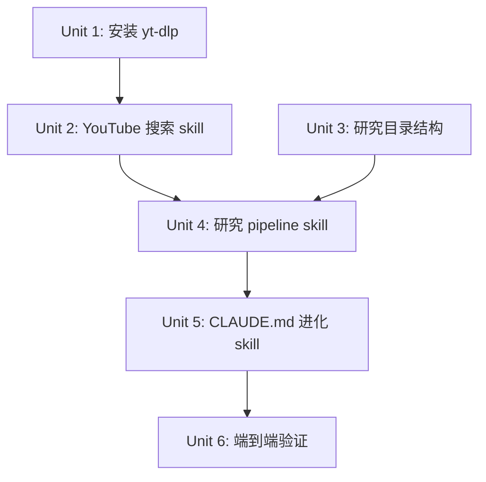

# feat: 自进化研究架构 — 多源 Pipeline + CLAUDE.md 进化闭环

## Overview

为用户现有的 Claude Code 生态（CE + Prismer + claude-mem + NotebookLM MCP + Obsidian）增加两个核心能力：
1. **研究 Pipeline Skill** — 一条命令完成"多源数据采集 → NotebookLM 深度分析 → Obsidian 知识沉淀"
2. **CLAUDE.md 自进化 Skill** — 扫描 Obsidian 近期笔记，提取新发现，仅追加到 CLAUDE.md

## Problem Frame

用户的研究工作流目前是手动逐步操作：搜索 → 打开 NotebookLM → 手动查询 → 手动整理笔记。CLAUDE.md 虽然成熟但是静态的，无法从不断增长的知识库中自动学习。(see origin: docs/brainstorms/2026-04-02-self-evolving-research-architecture-requirements.md)

## Requirements Trace

- R1. YouTube 搜索 skill（yt-dlp）
- R2. YouTube → NotebookLM 集成
- R3. 网页 → NotebookLM（defuddle）
- R4. PDF/文本 → NotebookLM
- R5. 统一研究 pipeline skill
- R6. Pipeline 参数化
- R7. 结果写入 Obsidian（双链 + frontmatter）
- R8. Pipeline 完成后建议进化
- R9. CLAUDE.md 进化 skill
- R10. 仅追加模式
- R11. Diff 预览 + 用户审批
- R12. 进化内容范围
- R13. 安装 yt-dlp

## Scope Boundaries

- 不修改 CLAUDE.md 已有规则——仅追加到新章节
- 不构建 Graph RAG——继续使用 Obsidian 文件系统
- 不自动执行进化——始终需要用户审批
- 不替换 CE / claude-mem / Prismer——是补充
- YouTube skill 仅搜索元数据 + URL 传递，不下载视频

## Context & Research

### Relevant Code and Patterns

- **Skill 结构模板**: `~/.claude/skills/defuddle/SKILL.md` — 最简洁的 skill 示例
- **NotebookLM MCP 工具**: `mcp__notebooklm-mcp__source_add`、`notebook_create`、`notebook_query`、`research_start`、`studio_create`
- **defuddle 调用**: `defuddle parse <url> --md` — 已有 skill
- **Obsidian 活跃目录**: `Knowledge Base/3. Efforts/Ongoing/` — 进行中项目
- **CLAUDE.md 末尾**: `# Task Management` 章节是最后一个顶级章节

### Institutional Learnings

- NotebookLM `research_start(mode="deep")` 约 5 分钟处理 40 来源
- Obsidian MCP `patch_content` 只能用 `#` 一级标题定位，子标题用 Edit 工具直接磁盘编辑
- studio_create 是异步的，需 studio_status 轮询
- confirm 参数必须先设 false 展示，用户确认后再设 true

## Key Technical Decisions

- **手写 SKILL.md 而非 skill-creator**：Pipeline 涉及多 MCP 工具编排 + 条件逻辑，skill-creator 更适合简单 skill。手写给予完全控制权
- **研究笔记存放位置**：`Knowledge Base/3. Efforts/Ongoing/研究/` — 符合 ACE 框架的 Efforts 层，且 Ongoing 表示活跃研究
- **进化扫描范围**：扫描整个 Knowledge Base 最近 N 天修改的 .md 文件（用 find -mtime），而非限定特定目录。因为有价值的新发现可能出现在任何位置
- **Pipeline 不创建独立 notebook**：每次研究复用或创建以主题命名的 notebook，避免 notebook 泛滥
- **yt-dlp 搜索方式**：使用 `yt-dlp "ytsearch10:<query>" --flat-playlist --dump-json` 获取搜索结果 JSON，不下载视频

## Open Questions

### Resolved During Planning

- **研究笔记目录**: `Knowledge Base/3. Efforts/Ongoing/研究/` — 基于 ACE 框架 Efforts 层
- **Skill 创建方式**: 手写 SKILL.md — Pipeline 复杂度需要完全控制
- **进化扫描范围**: 全 Vault 最近 N 天修改的 .md 文件

### Deferred to Implementation

- yt-dlp 搜索结果的具体 JSON 字段可能随版本变化，实现时需验证
- NotebookLM `source_add` 对不同来源类型的响应格式，实现时确认

## Implementation Units



- [ ] **Unit 1: 安装 yt-dlp 并验证**

**Goal:** 安装 YouTube 搜索的底层依赖 (R13)

**Requirements:** R13

**Dependencies:** None

**Files:**
- 无文件变更，仅系统安装

**Approach:**
- 使用 `brew install yt-dlp`（用户 macOS 环境）
- 验证 `yt-dlp --version` 和 `yt-dlp "ytsearch3:claude code" --flat-playlist --dump-json` 返回有效 JSON

**Test expectation:** none — 纯安装，通过命令行验证

**Verification:**
- `which yt-dlp` 返回有效路径
- 搜索命令返回 JSON 结果

---

- [ ] **Unit 2: 创建 YouTube 搜索 skill**

**Goal:** 创建 `/yt-search` skill，封装 yt-dlp 搜索能力 (R1)

**Requirements:** R1

**Dependencies:** Unit 1

**Files:**
- Create: `~/.claude/skills/yt-search/SKILL.md`

**Approach:**
- SKILL.md frontmatter: `name: yt-search`, `description: 搜索 YouTube 视频并返回结构化结果。当用户需要搜索 YouTube 视频、查找视频内容时使用。`
- 内容定义 skill 的使用方式：接受搜索关键词，使用 `yt-dlp "ytsearch<N>:<query>" --flat-playlist --dump-json` 执行搜索
- 输出格式：Markdown 表格（标题、URL、时长、观看数、上传日期）
- 包含安装检查：未安装时提示 `brew install yt-dlp`

**Patterns to follow:**
- `~/.claude/skills/defuddle/SKILL.md` 的简洁结构

**Test scenarios:**
- Happy path: `/yt-search "claude code MCP"` 返回 10 条结构化视频结果
- Happy path: 自定义数量 `/yt-search "AI agents" --count 5` 返回 5 条
- Error path: yt-dlp 未安装时输出安装指引

**Verification:**
- Skill 出现在 `/` 命令列表中
- 搜索返回格式化的视频列表

---

- [ ] **Unit 3: 创建 Obsidian 研究目录结构**

**Goal:** 在 Obsidian Vault 中建立研究笔记的标准存放位置 (R7)

**Requirements:** R7

**Dependencies:** None（可与 Unit 1-2 并行）

**Files:**
- Create: `Knowledge Base/3. Efforts/Ongoing/研究/` 目录
- Create: `Knowledge Base/3. Efforts/Ongoing/研究/_INDEX.md` — 研究笔记索引
- Create: `Knowledge Base/Templates/研究笔记模板.md` — Obsidian 模板

**Approach:**
- 研究笔记模板包含 frontmatter（date、topic、source_type、notebook_id、tags）、摘要、关键发现、双链
- _INDEX.md 用 Dataview 查询自动列出研究笔记

**Test expectation:** none — 纯目录和模板创建

**Verification:**
- 目录和模板文件存在
- Obsidian 中可见新目录

---

- [ ] **Unit 4: 创建研究 Pipeline Skill**

**Goal:** 创建 `/research-pipeline` 统一 skill，一条命令完成多源采集 → NotebookLM 分析 → Obsidian 写入 (R2-R8)

**Requirements:** R2, R3, R4, R5, R6, R7, R8

**Dependencies:** Unit 2, Unit 3

**Files:**
- Create: `~/.claude/skills/research-pipeline/SKILL.md`
- Create: `~/.claude/skills/research-pipeline/references/notebooklm-tools.md` — NotebookLM MCP 工具速查

**Approach:**
- SKILL.md 定义完整的 pipeline 工作流，分为 4 个阶段：
  1. **数据采集**：根据 source_type 参数分发
     - `youtube`: 调用 `/yt-search` 获取视频列表 → 用户选择 → `source_add(source_type=youtube, url=...)` 添加到 NotebookLM
     - `web`: 调用 `defuddle parse <url> --md` 提取内容 → `source_add(source_type=url, url=...)` 或 `source_add(source_type=text, text=...)`
     - `text`/`file`: 直接 `source_add(source_type=text/file, ...)`
  2. **NotebookLM 分析**：`notebook_query` 或 `research_start` 进行深度分析
  3. **交付物生成**（可选）：`studio_create` 生成信息图/音频/slides 等
  4. **Obsidian 写入**：用研究笔记模板格式化结果，写入 `Knowledge Base/3. Efforts/Ongoing/研究/`，包含 Obsidian 双链和标签
- Pipeline 完成后输出提示："研究完成！建议运行 `/evolve-claude-md` 更新 CLAUDE.md（基于近期知识积累）"
- references/notebooklm-tools.md 列出常用 MCP 工具的参数格式，供 skill 执行时参考

**Patterns to follow:**
- `~/.claude/skills/defuddle/SKILL.md` 的 Bash 命令集成方式
- NotebookLM MCP 使用说明书中的工具调用规范

**Test scenarios:**
- Happy path: YouTube 流程 — `/research-pipeline youtube "claude code skills"` → 搜索 → 选择视频 → NotebookLM 分析 → 写入 Obsidian
- Happy path: Web 流程 — `/research-pipeline web "https://example.com/article"` → defuddle 提取 → NotebookLM 分析 → 写入 Obsidian
- Happy path: 带交付物 — `/research-pipeline youtube "AI agents" --deliverable infographic` → 完成后包含信息图
- Edge case: NotebookLM 认证过期 → 提示运行 `nlm login`
- Edge case: 无搜索结果 → 提示调整关键词
- Integration: Pipeline 完成后输出 `/evolve-claude-md` 建议

**Verification:**
- YouTube pipeline 端到端：搜索 → 分析 → Obsidian 中出现新研究笔记
- Web pipeline 端到端：URL → 分析 → Obsidian 中出现新研究笔记
- 生成的笔记包含正确的 frontmatter、双链、标签

---

- [ ] **Unit 5: 创建 CLAUDE.md 进化 Skill**

**Goal:** 创建 `/evolve-claude-md` skill，扫描 Obsidian 近期笔记，提取新发现，仅追加到 CLAUDE.md (R9-R12)

**Requirements:** R9, R10, R11, R12

**Dependencies:** Unit 4（进化 skill 独立，但在 pipeline 之后实现以确保有笔记可扫描）

**Files:**
- Create: `~/.claude/skills/evolve-claude-md/SKILL.md`

**Approach:**
- SKILL.md 定义进化工作流，分为 3 个阶段：
  1. **扫描**：用 `find "Knowledge Base" -name "*.md" -mtime -<N> -type f` 获取最近 N 天（默认 7）修改的笔记文件，排除 `.obsidian/`、`.smart-env/`、`Templates/` 等系统目录
  2. **分析**：读取这些笔记，提取以下类别的新发现：
     - 新工作偏好（输出格式、分析方法、交互风格）
     - 新工具/技术经验（新 skill 用法、MCP 技巧、命令行技巧）
     - 新 patterns（反复出现的工作模式、决策模式）
     - 教训（踩坑记录、需要避免的做法）
  3. **审批与追加**：
     - 生成 diff 预览，展示将要追加的内容
     - 用 AskUserQuestion 请求用户确认
     - 确认后追加到 CLAUDE.md 末尾的 `# 进化日志` 章节
     - 每条记录带日期戳：`## YYYY-MM-DD 进化`
- 进化日志格式：
  ```markdown
  # 进化日志

  ## 2026-04-02 进化
  
  **新发现：**
  - [类别] 发现内容
  ```
- 硬规则：绝不修改 `# 进化日志` 以上的任何内容

**Patterns to follow:**
- CLAUDE.md 现有的 Markdown 结构风格
- claude-mem 的观察摘要格式（简洁、有时间戳）

**Test scenarios:**
- Happy path: 有近期笔记时，扫描 → 提取发现 → 展示 diff → 用户确认 → 追加成功
- Happy path: 带自定义时间范围 `/evolve-claude-md --days 30` 扫描最近 30 天
- Edge case: 近期无新笔记 → 提示"无新发现，无需进化"
- Edge case: 扫描到的笔记无有价值的新发现 → 提示"已扫描 N 篇笔记，未发现新 patterns"
- Error path: 用户拒绝 diff → 不做任何修改，退出
- Integration: CLAUDE.md 追加后内容格式正确，不破坏现有内容

**Verification:**
- 运行后 CLAUDE.md 末尾出现 `# 进化日志` 章节（首次）或新增日期条目（后续）
- 原有 239 行内容完全不变
- 用户审批流程正常工作

---

- [ ] **Unit 6: 端到端验证**

**Goal:** 验证整套系统的完整闭环 (所有 R)

**Requirements:** 所有

**Dependencies:** Unit 1-5

**Files:**
- 无新文件，验证现有 skills

**Approach:**
- 执行完整 YouTube pipeline：搜索 → 选择 → NotebookLM 分析 → Obsidian 写入
- 执行完整 Web pipeline：URL → NotebookLM 分析 → Obsidian 写入
- 执行进化：`/evolve-claude-md` 扫描刚生成的研究笔记 → 提取发现 → 审批追加
- 验证闭环：Pipeline 结果 → 进化发现 → CLAUDE.md 更新

**Test scenarios:**
- Integration: YouTube → NotebookLM → Obsidian → evolve → CLAUDE.md 完整闭环
- Integration: Web → NotebookLM → Obsidian → evolve → CLAUDE.md 完整闭环

**Verification:**
- Knowledge Base 中有新的研究笔记
- CLAUDE.md 末尾有进化日志
- 原有系统（CE / claude-mem / Prismer）不受影响

## System-Wide Impact

- **Interaction graph:** 新 skills 调用已有的 NotebookLM MCP 工具和 defuddle skill，不引入新的外部依赖
- **Error propagation:** NotebookLM 认证过期时，所有涉及 MCP 的操作会失败 → skill 应捕获并提示 `nlm login`
- **State lifecycle risks:** NotebookLM notebook 可能积累过多来源（上限 50）→ pipeline 应检查现有来源数
- **API surface parity:** 不涉及 — 这是纯 skill 层变更
- **Integration coverage:** pipeline 跨越 yt-dlp CLI → NotebookLM MCP → Obsidian 文件系统三层，需要端到端测试
- **Unchanged invariants:** 现有 CLAUDE.md 的全部内容（L1-239）不可修改；现有 CE/claude-mem/Prismer 工作流不受影响

## Risks & Dependencies

| Risk | Mitigation |
|------|------------|
| yt-dlp 搜索 API 可能变化 | skill 中封装搜索命令，变化时只需更新一处 |
| NotebookLM MCP 认证过期 | skill 捕获认证错误，提示 `nlm login` |
| NotebookLM notebook 来源上限 50 | pipeline 检查来源数，满时提示创建新 notebook |
| 进化扫描产生噪音 | 排除系统目录（.obsidian, .smart-env, Templates），仅处理用户内容 |
| CLAUDE.md 进化追加导致文件过长 | 进化日志章节可定期人工归档旧条目 |

## Sources & References

- **Origin document:** [docs/brainstorms/2026-04-02-self-evolving-research-architecture-requirements.md](docs/brainstorms/2026-04-02-self-evolving-research-architecture-requirements.md)
- NotebookLM MCP 使用说明书: `Knowledge Base/项目/Skills 使用手册/NotebookLM MCP 使用说明书.md`
- Skill 结构参考: `~/.claude/skills/defuddle/SKILL.md`
- 视频教程 NotebookLM notebook: `645a6444-6267-4b06-b1aa-739c6a3b2b33`
