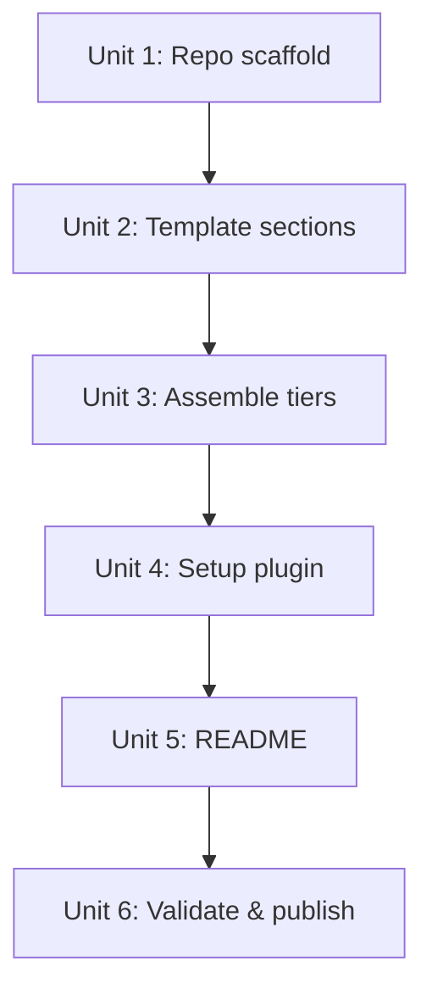

# feat: Ship Forge workflow starter kit

**Target repo:** eisen0419/forge (new repo, separate from Revolve)

## Overview

Create Forge, an open-source starter kit that packages a battle-tested AI-assisted development workflow as a reusable CLAUDE.md template + lightweight setup plugin. Two tiers (Essential for newcomers, Full for power users) ensure the methodology is accessible without being overwhelming.

## Problem Frame

Claude Code users reinvent workflow patterns through trial and error. Forge provides a verified structural starting point — task routing, error recovery, quality gates, knowledge compounding — that would otherwise take months of iteration to discover. (see origin: `docs/brainstorms/2026-04-02-forge-starter-kit-requirements.md`)

## Requirements Trace

- R1–R4. CLAUDE.md template: modular sections, fill-in-the-blank variables, inline comments, standalone
- R5–R7. Role system: abstract roles, peer review, Claude-only defaults with commented alternatives
- R8–R11. Task routing & error recovery: decision framework, routing table, circuit breaker, compact recovery
- R12–R14. Quality gates: tiered testing, verification discipline, blast radius protocol
- R15–R17. Knowledge compounding: compound discipline, docs/solutions/ pattern, Revolve as documented recommendation
- R18–R19. Tiered templates: Essential (newcomers) vs Full (power users), selected via /forge-setup
- R20–R23. Setup plugin: /forge-setup skill, config wizard, CLAUDE.md generation, print plugin install commands
- R24–R25. Documentation: English README with inline philosophy, "Works with" compatibility table
- R26–R29. Distribution: GitHub repo, self-hosted marketplace, standalone template, MIT license

## Scope Boundaries

- Not reimplementing CE, gstack, or Revolve
- Not auto-evolving CLAUDE.md — Revolve handles that
- Not including personal configurations
- Not a "production-grade CLAUDE.md" — a verified structural starting point
- /forge-check deferred to post-v1.0

## Key Technical Decisions

- **Single file template**: CLAUDE.md has no import syntax. Templates are single `.md` files with clearly marked sections. `/forge-setup` concatenates sections based on tier selection at generation time. Source templates are organized as section fragments for maintainability, assembled into one output file.

- **Tier content split**:

  | Section | Essential | Full |
  |---------|-----------|------|
  | User / Preferences | ✅ | ✅ |
  | Instruction Priority | ✅ | ✅ |
  | Decision Three Questions | ✅ | ✅ |
  | Task Routing Table | ✅ (simplified) | ✅ (full with upgrade/downgrade signals) |
  | Error Recovery Circuit Breaker | ❌ | ✅ |
  | Compact Recovery Discipline | ❌ | ✅ |
  | Quality Gates (Level 0-2) | ✅ | ✅ (Level 0-4) |
  | Verification Discipline | ✅ | ✅ |
  | Blast Radius Protocol | ❌ | ✅ |
  | Role System | ❌ | ✅ |
  | Peer Review Framework | ❌ | ✅ |
  | Subagent Strategy | ❌ | ✅ |
  | Knowledge Compounding | ❌ | ✅ |
  | Git Conventions | ✅ | ✅ |
  | Safety Rules | ✅ | ✅ |
  | Task Management | ✅ | ✅ |

- **CLAUDE.md write strategy**: `/forge-setup` detects CLAUDE.md location by checking `./CLAUDE.md` (project) → `~/CLAUDE.md` (global). Uses Write tool to create/overwrite. If target already exists, shows diff preview and asks for confirmation. Fallback: save as `./CLAUDE.md.forge` with copy instructions.

- **Role system is a CLAUDE.md instruction convention**: A markdown mapping table that Claude reads at inference time. Not a Claude Code API feature. Template shows this explicitly in inline comments.

- **Print, don't install**: `/forge-setup` prints `claude plugin marketplace add` and `claude plugin install` commands for recommended plugins. Does not attempt programmatic installation.

## Open Questions

### Resolved During Planning

- **CLAUDE.md write path**: Detect `./CLAUDE.md` or `~/CLAUDE.md`, Write tool can write to either. Fallback to `.forge` file if user declines overwrite
- **Template modularity**: Source fragments in `templates/sections/`, assembled into single output. Users copying manually use the pre-assembled `templates/essential.md` or `templates/full.md`
- **Tier split**: See decision table above — Essential covers ~60% of sections (core rules), Full covers 100%

### Deferred to Implementation

- Exact wording of inline comments for each section — depends on writing and testing against real Claude Code sessions
- Whether `/forge-setup` should detect existing CLAUDE.md content and offer to merge vs. replace
- Optimal phrasing of recommended plugin install commands

## High-Level Technical Design

> *Directional guidance for review, not implementation specification.*

```
forge/                             # GitHub repo
├── .claude-plugin/
│   ├── plugin.json                # name: "forge"
│   └── marketplace.json           # self-hosted
├── skills/
│   └── forge-setup/
│       └── SKILL.md               # interactive setup wizard
├── templates/
│   ├── sections/                  # source fragments (one per section)
│   │   ├── 00-user.md
│   │   ├── 01-preferences.md
│   │   ├── 02-instruction-priority.md
│   │   ├── 03-decision-questions.md
│   │   ├── 04-task-routing.md
│   │   ├── 05-error-recovery.md       # Full only
│   │   ├── 06-compact-recovery.md     # Full only
│   │   ├── 07-quality-gates.md
│   │   ├── 08-verification.md
│   │   ├── 09-blast-radius.md         # Full only
│   │   ├── 10-role-system.md          # Full only
│   │   ├── 11-peer-review.md          # Full only
│   │   ├── 12-subagent-strategy.md    # Full only
│   │   ├── 13-knowledge-compounding.md # Full only
│   │   ├── 14-git-conventions.md
│   │   ├── 15-safety-rules.md
│   │   └── 16-task-management.md
│   ├── essential.md               # pre-assembled Essential tier
│   └── full.md                    # pre-assembled Full tier
├── README.md
├── LICENSE
├── CHANGELOG.md
└── .gitignore
```

## Implementation Units



- [ ] **Unit 1: Repo scaffold and manifest**

**Goal:** Create the Forge repo with plugin manifest, marketplace.json, license, gitignore.

**Requirements:** R26, R27, R29

**Dependencies:** None

**Files:**
- Create: `.claude-plugin/plugin.json`
- Create: `.claude-plugin/marketplace.json`
- Create: `LICENSE`
- Create: `CHANGELOG.md`
- Create: `.gitignore`

**Approach:**
- Mirror Revolve's plugin structure (same pattern, proven working)
- `plugin.json`: name "forge", version "0.1.0", MIT license

**Patterns to follow:**
- Revolve's `.claude-plugin/plugin.json` and `marketplace.json`

**Test scenarios:**
- Test expectation: none — pure scaffolding

**Verification:**
- Plugin manifest validates (JSON valid, name matches regex)

---

- [ ] **Unit 2: Write template section fragments**

**Goal:** Create individual markdown section files that form the CLAUDE.md methodology, with fill-in-the-blank variables and inline comments explaining each section.

**Requirements:** R1, R2, R3, R4, R5, R6, R7, R8, R9, R10, R11, R12, R13, R14, R15, R16, R17

**Dependencies:** Unit 1

**Files:**
- Create: `templates/sections/00-user.md` through `templates/sections/16-task-management.md`

**Approach:**
- Extract methodology from the user's actual CLAUDE.md (known structure from this session)
- Replace all personal values with `{{variables}}`: `{{USER_NAME}}`, `{{PLATFORM}}`, `{{LANGUAGE}}`, `{{COMMIT_STYLE}}`
- Each section starts with a comment block: what it does, why it exists, how to customize
- Role system section (10-role-system.md): mapping table with Claude defaults, commented-out multi-provider examples
- Quality gates section: Essential version has Level 0-2, Full version has Level 0-4 (use conditional markers `<!-- FULL_ONLY_START -->` / `<!-- FULL_ONLY_END -->`)
- R17: Knowledge compounding section mentions Revolve as recommended automation, describes manual workflow as default
- All section files are self-contained — no cross-references that break if a section is excluded

**Patterns to follow:**
- User's CLAUDE.md at `~/CLAUDE.md` for exact methodology content
- Revolve's `config.md.example` for variable/comment style

**Test scenarios:**
- Happy path: each section file is valid markdown, contains at least one `{{variable}}`, has an explanatory comment block
- Edge case: section files with `<!-- FULL_ONLY -->` markers can be stripped cleanly by the assembler
- Integration: concatenating all Essential sections produces a coherent CLAUDE.md with no broken references

**Verification:**
- 17 section files exist, all valid markdown
- `grep -r '{{' templates/sections/` returns variables in every file with user-specific content
- No hardcoded personal paths/names remain

---

- [ ] **Unit 3: Assemble tier templates**

**Goal:** Create pre-assembled `essential.md` and `full.md` templates from section fragments, ready for manual copy.

**Requirements:** R18, R28

**Dependencies:** Unit 2

**Files:**
- Create: `templates/essential.md`
- Create: `templates/full.md`

**Approach:**
- Concatenate Essential sections (per tier split table) into `essential.md`, stripping `FULL_ONLY` markers
- Concatenate all sections into `full.md`, keeping all content
- Both files have `{{variables}}` — users do find-and-replace manually or use `/forge-setup`
- Add a header comment in each file explaining the tier and how to customize

**Patterns to follow:**
- Revolve's `config.md.example` header style

**Test scenarios:**
- Happy path: `essential.md` contains ~10 sections, `full.md` contains all 17
- Edge case: `essential.md` has no `FULL_ONLY` content remaining
- Happy path: both files are valid standalone CLAUDE.md when variables are filled in

**Verification:**
- `grep -c '<!-- FULL_ONLY' templates/essential.md` returns 0
- `wc -l` shows Full is substantially larger than Essential
- Both files start with `# CLAUDE.md` header

---

- [ ] **Unit 4: Setup plugin skill (`/forge-setup`)**

**Goal:** Create the interactive `/forge-setup` skill that generates a customized CLAUDE.md from user answers.

**Requirements:** R19, R20, R21, R22, R23

**Dependencies:** Unit 3

**Files:**
- Create: `skills/forge-setup/SKILL.md`

**Approach:**
- Frontmatter: third-person description, `argument-hint: (no arguments)`
- Flow:
  1. Ask experience level (Essential / Full) via AskUserQuestion
  2. Ask user name, platform, preferred language
  3. Full tier only: ask role assignments, testing strategy level
  4. Ask git conventions (conventional commits, etc.)
  5. Read the appropriate tier template (`templates/essential.md` or `templates/full.md`)
  6. Replace `{{variables}}` with user answers
  7. Detect CLAUDE.md path: check `./CLAUDE.md` exists → `~/CLAUDE.md` exists → default to `./CLAUDE.md`
  8. If target exists: show preview of what will change, ask to overwrite/backup/cancel
  9. Write via Write tool. If fails: save as `./CLAUDE.md.forge` with instructions
  10. Print recommended plugin install commands (CE, Revolve)
- Do NOT attempt to install plugins programmatically

**Patterns to follow:**
- Revolve's `/revolve-setup` skill (AskUserQuestion flow, dependency messaging)

**Test scenarios:**
- Happy path: Essential tier → asks 4 questions → generates CLAUDE.md with filled variables at `./CLAUDE.md`
- Happy path: Full tier → asks 6+ questions → generates larger CLAUDE.md with role table and circuit breaker
- Edge case: existing CLAUDE.md found → shows diff preview, user confirms overwrite
- Edge case: existing CLAUDE.md found → user cancels → no write, clean exit
- Error path: Write to target path fails → saves to `./CLAUDE.md.forge` with copy instructions
- Happy path: after generation, prints recommended plugin commands (not runs them)

**Verification:**
- Generated CLAUDE.md contains no `{{variables}}` — all replaced
- Skill triggers on "forge setup", "set up forge", "configure forge"
- Essential output is shorter than Full output

---

- [ ] **Unit 5: README**

**Goal:** Create English README with quickstart, philosophy, and plugin compatibility.

**Requirements:** R24, R25

**Dependencies:** Units 1–4

**Files:**
- Create: `README.md`

**Approach:**
- Header: "Forge — AI-Assisted Development Workflow Starter Kit"
- Sections: What is Forge, Why not just copy a CLAUDE.md, Quickstart (plugin install + `/forge-setup` OR manual copy), What's in the template (section overview with Essential/Full tier markers), Works with (CE, gstack, Revolve, standalone — simple table), Customization guide, License
- Philosophy rationale integrated inline (not a separate guide) — brief "why" for key sections like circuit breaker and task routing
- Differentiation section addressing "why not just copy from GitHub"

**Patterns to follow:**
- Revolve's README structure (concise, imperative)

**Test scenarios:**
- Happy path: new user follows quickstart → gets a working CLAUDE.md
- Integration: all referenced paths in README exist in the repo

**Verification:**
- No broken internal links
- Quickstart covers both plugin and manual paths
- "Works with" table has 4 rows (CE, gstack, Revolve, standalone)

---

- [ ] **Unit 6: Validate and publish**

**Goal:** Final validation and GitHub publish.

**Requirements:** R26, R27

**Dependencies:** Units 1–5

**Files:**
- Modify: `CHANGELOG.md` (v0.1.0 entry)
- Modify: `.claude-plugin/plugin.json` (version confirm)

**Approach:**
- Verify no hardcoded personal paths: `grep -r '/Users/' templates/ skills/`
- Verify all `{{variables}}` are documented
- Verify both tier templates are valid markdown
- Create GitHub repo `eisen0419/forge`, push to main
- Verify self-hosted marketplace install works conceptually (same pattern as Revolve)

**Test scenarios:**
- Happy path: `grep -r '/Users/' templates/ skills/` returns 0 matches
- Happy path: both `essential.md` and `full.md` render as valid CLAUDE.md structure

**Verification:**
- GitHub repo live at `eisen0419/forge`
- All files committed, no sensitive data

## System-Wide Impact

- **Interaction graph:** `/forge-setup` reads template files → replaces variables → writes CLAUDE.md. No callbacks, no MCP, no external services
- **Error propagation:** Write failure → fallback to `.forge` file. All other operations are pure template processing
- **Unchanged invariants:** Does not modify any existing plugin, CLAUDE.md, or Claude Code settings. Pure additive

## Risks & Dependencies

| Risk | Mitigation |
|------|------------|
| Template variables not all replaced | `/forge-setup` validates no `{{` remains before writing |
| Users confused by Essential vs Full choice | README explains both tiers clearly; `/forge-setup` describes each before asking |
| Template becomes stale as methodology evolves | Version in CHANGELOG; users can re-run `/forge-setup` to regenerate |
| Write tool can't write to `~/CLAUDE.md` | Fallback path documented in R22: save as `.forge` file |

## Sources & References

- **Origin document:** `docs/brainstorms/2026-04-02-forge-starter-kit-requirements.md`
- User's methodology source: `~/CLAUDE.md`
- Plugin structure pattern: Revolve's `.claude-plugin/`
- Setup skill pattern: Revolve's `skills/revolve-setup/SKILL.md`
